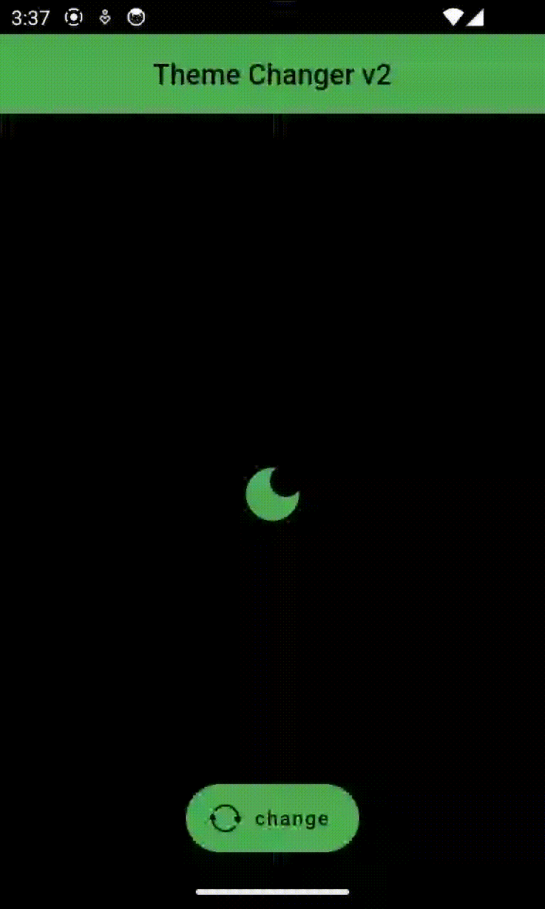

# getx getstorage theme changer v2

It's a GetX based theme changer application, where I use a dedicate class to handle the states of theme. So if you want this use in your future project, you have to know some principle of GetX statement.

In this project I separated 2 parts the main theme handler class. So when I want to upgrade the list of colors. I go simply in the ThemeColors extension class. And I write some line in it:

```dart
part of 'theme_controller.dart';

extension ThemeColors on ThemeController {
  Color get iconColor => _colors(
        light: Colors.white,
        dark: Colors.black,
      );

  Color get textColor => _colors(
        light: Colors.white,
        dark: Colors.black,
      );

  Color get bodyColor => _colors(
        light: Colors.white,
        dark: Colors.black,
      );

  Color get buttonColor => _colors(
        light: Colors.blue,
        dark: Colors.green,
      );

  Color get headerColor => _colors(
        light: Colors.blue,
        dark: Colors.green,
      );
}

```

If you done the declaration of the colors. You can simple use through the ThemeController in your views like this. 

```dart
import 'package:flutter/cupertino.dart';
import 'package:flutter/material.dart';
import 'package:getx_getstorage_theme_changer_v2/controllers/theme_controller.dart';
import 'package:getx_getstorage_theme_changer_v2/storage/theme_storage.dart';

class HomeScreen extends StatelessWidget {
  ThemeController theme;
  HomeScreen(this.theme);

  @override
  Widget build(BuildContext context) {
    return SafeArea(
      child: Scaffold(
        backgroundColor: theme.bodyColor,
        appBar: AppBar(
          title: Text(
            "Theme Changer v2",
            style: TextStyle(color: theme.textColor),
          ),
          centerTitle: true,
          backgroundColor: theme.headerColor,
        ),
        body: Center(
          child: Icon(
            (theme.currentTheme == Themes.dark)
                ? Icons.dark_mode
                : Icons.light_mode,
            color: theme.buttonColor,
            size: 50,
          ),
        ),
        floatingActionButtonLocation: FloatingActionButtonLocation.centerFloat,
        floatingActionButton: FloatingActionButton.extended(
            label: Text(
              "change",
              style: TextStyle(
                color: theme.textColor,
              ),
            ),
            backgroundColor: theme.buttonColor,
            onPressed: () {
              theme.switchTheme();
            },
            icon: Icon(
              CupertinoIcons.arrow_2_circlepath,
              color: theme.iconColor,
            )),
      ),
    );
  }
}
```


You can checkout this project:



